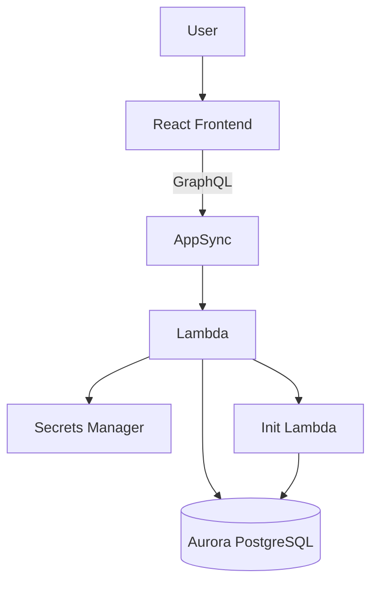

# EMR – Appointment Scheduling & Queue Management System

This project implements **Feature B – Appointment Scheduling and Queue Management** as required in the assignment.  
It is a **fully working system**, not just a simulation.

---

## System Architecture



---

## Feature Mapping to Assignment Requirements

### Task 1 — Backend Service

| Requirement            | Status                                  |
| ---------------------- | --------------------------------------- |
| Mock Data / DB         | Implemented using **real Aurora DB**    |
| Filtering              | Implemented → `getAppointments`         |
| Status Update          | Implemented → `updateAppointmentStatus` |
| Create Appointment     | Implemented → conflict safe             |
| Delete Appointment     | Implemented                             |
| Consistency Guarantees | Enforced via SQL + Unique Constraints   |

---

### Task 2 — Frontend Integration

| Requirement                     | Status                |
| ------------------------------- | --------------------- |
| Fetch from backend              | Implemented           |
| Calendar Filtering              | Implemented           |
| Tab Filtering                   | Implemented           |
| Status Update                   | Implemented           |
| Create Appointment              | Implemented           |
| No frontend-only state mutation | ✔ Uses backend always |

---

## Data Consistency Strategy

Even though requirement suggested mock DB, we implemented **production grade guarantees**

### Consistency Rules

* Aurora DB used
* Writes are transactional
* Unique Constraint:

```
UNIQUE (doctor_name, date, time)
```

Prevents double booking.

###  Idempotency

Every appointment has UUID
Repeated requests can't duplicate record.

### Real-Time

If AppSync Subscriptions were enabled:

* `updateAppointmentStatus`
* `createAppointment`
  would broadcast to UI

---

## GraphQL Contract Designed

### **Query**

```graphql
query GetAppointments($date: String, $status: String, $doctorName: String) {
  getAppointments(date: $date, status: $status, doctorName: $doctorName) {
    id patientName doctorName date time duration status mode
  }
}
```

### **Create**

```graphql
mutation CreateAppointment($input: CreateAppointmentInput!) {
  createAppointment(input: $input) {
    id patientName status
  }
}
```

### **Update**

```graphql
mutation UpdateAppointmentStatus($id: ID!, $new_status: String!) {
  updateAppointmentStatus(id: $id, new_status: $new_status) {
    id status
  }
}
```

### **Delete**

```graphql
mutation DeleteAppointment($id: ID!) {
  deleteAppointment(id: $id)
}
```

---

## Tech Used & Why

| Tech                   | Role            |
| ---------------------- | --------------- |
| AWS AppSync            | Managed GraphQL |
| Lambda Python          | Business Logic  |
| Aurora Serverless v2   | Database        |
| AWS CDK                | Infra as Code   |
| React + Tailwind       | UI              |
| Amplify GraphQL Client | API Calls       |
| date-fns               | Date logic      |
| Lucide Icons           | UI polish       |

---

## Author

Built by **Piyush Dahake**
